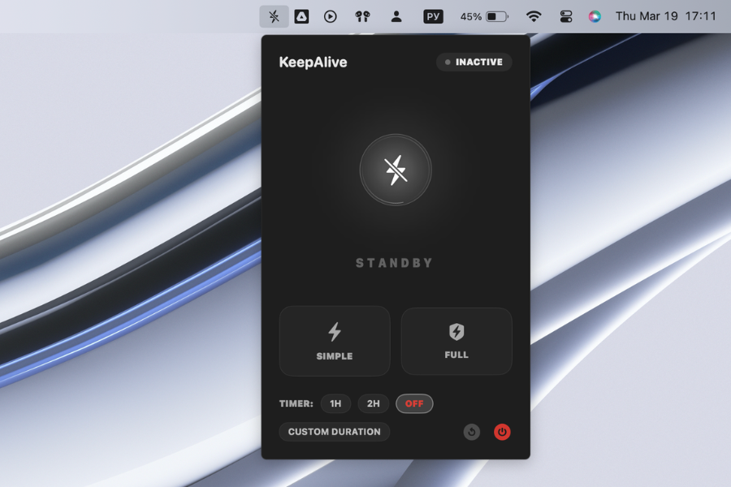
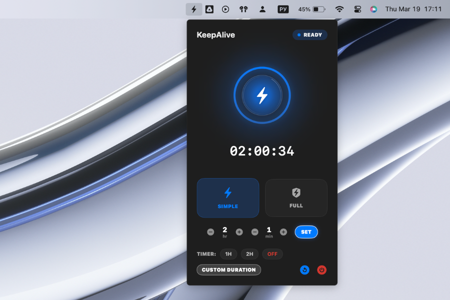
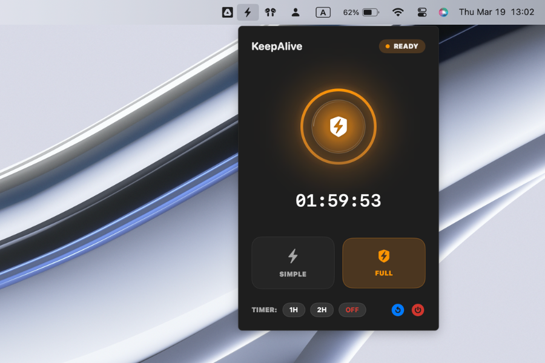

# KeepAlive Mac App

KeepAlive is a premium, high-performance macOS utility designed to prevent your system from falling asleep. Whether you need to run long-running Python scripts, keep a remote session active, or prevent your screen from dimming during a presentation, KeepAlive provides a sleek and reliable solution.

## 📸 UI Preview

| **Standby Mode (OFF)** | **Simple Mode** | **Full Mode** |
|:---:|:---:|:---:|
|  |  |  |

## 🚀 Key Features

- **Simple Mode**: Prevents idle sleep using `caffeinate -i`. Safe for everyday use and requires no admin privileges.
- **Full Mode**: Prevents all sleep, including lid-closed sleep, using `pmset -a disablesleep 1`. Perfect for MacBook users who need their machine to stay active while closed. (Requires Admin privileges).
- **Auto-Off Timer**: Set a duration (1 hour or 2 hours) after which KeepAlive will automatically restore your standard energy settings.
- **Ultra-Premium UI**: A stunning, futuristic interface featuring:
  - **Animated Status Orb**: Visual confirmation of active state.
  - **Circular Progress Timer**: Glowing ring showing remaining time.
  - **Glassmorphism**: Native macOS Sequoia-style translucent materials.
  - **True Dark Mode**: Deep midnight black aesthetic for high-end workspace integration.

## ⚡️ Quick Start (Recommended)

If you don't want to build from source, you can use the pre-compiled version:

1.  **Download**: Go to the [Latest Release](https://github.com/stas-gatin/KeepAlive_Mac_App/releases) and download `KeepAlive_v1.1.0.zip`.
2.  **Unpack**: Unzip the file and drag **KeepAlive.app** to your `/Applications` folder.
3.  **Launch**:
    -   Double-click to open. 
    -   *Note*: Since the app is not signed with an Apple Developer ID, you may need to **Right-click** on the app and select **Open**, then confirm by clicking **Open** again in the security dialog.
4.  **Enjoy**: Look for the bolt icon in your Menu Bar!

---

## 🧪 Tech Stack

- **Language**: Swift 6.0
- **Framework**: SwiftUI
- **OS Requirement**: macOS 14.0 (Sonoma) or newer
- **System Integration**: Secure shell execution via `Process` and AppleScript for authorized commands.

---

## 🏗 Development & Build

### Prerequisites
- macOS 14.0+
- Swift installed (comes with Xcode Command Line Tools)

### Build from Source
Open your terminal in the project directory and run:
```bash
swift build
```

### Run (from Terminal)
To start the app, run the compiled binary:
```bash
./.build/debug/KeepAlive
```

---

## 🚦 How to Use
1. Once launched, look for the **bolt icon** in your macOS Menu Bar.
2. Click the icon to open the KeepAlive control panel.
3. Select **SIMPLE** for basic wakefulness or **FULL** for lid-sleep prevention.
4. (Optional) Select a timer preset (1H, 2H) to auto-disable the mode.
5. Click the **Restore Defaults** (power icon) to return to standard system behavior.

## ⚠️ Safety Warning

**Full Mode** prevents the Mac from sleeping even when the lid is closed. 
- Please ensure your MacBook has proper ventilation when using this mode to avoid heat buildup.
- Do not keep the MacBook in a tight bag or sleeve while Full Mode is active.
